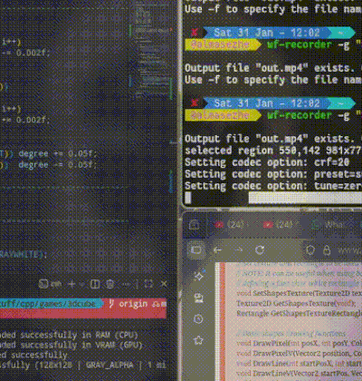

# 3D Software Renderer (Raylib 2D)

Tiny demo of 3D rendering using **pure math + 2D raylib**.  
Rotation matrices, perspective projection `x' = x/z`, no raylib 3D API.  
Raylib is used only for window, input and pixel drawing.

Inspired by Tsoding: https://www.youtube.com/watch?v=qjWkNZ0SXfo

<p align="center">
  
  
</p>


<p align="center">
  skull.gif &nbsp;&nbsp;|&nbsp;&nbsp; 3dcube.gif
</p>

## Features
- Manual rotation (yaw/pitch + object rotation)
- Perspective projection
- Works only with Raylib 2D drawing
- OBJ vertex loader (experimental)

## Files
- main.cpp – .obj model renderer
- cube.cpp – simple cube for testing math  

## Build
```zsh
$ g++ main.cpp -lraylib -lm -ldl -lpthread -lGL -o cube
```
